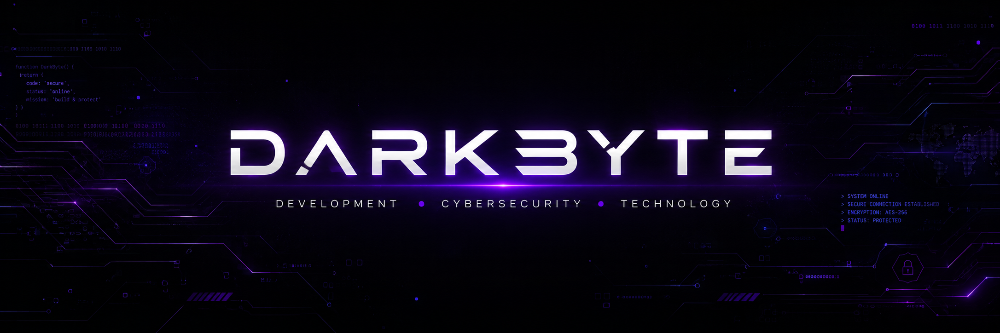

# DarkByte

Desenvolvedora em formação | Web & Software  
Transformando ideias em projetos digitais

---

*Sobre mim*

Sou desenvolvedora em formação e apaixonada por tecnologia, programação e desenvolvimento web.

Gosto de criar projetos que unam funcionalidade, design e criatividade. Atualmente, estou aprimorando meus conhecimentos em programação, desenvolvimento web, banco de dados e desenvolvimento de software.

Também tenho interesse em transformar projetos em soluções reais para pessoas e empresas.

---

*Tecnologias & Ferramentas*

*Linguagens*

*Desenvolvimento*

*Banco de dados*

*Ferramentas*

---

*Projetos em destaque*

*Crescer+*

Plataforma educacional desenvolvida para oferecer uma experiência digital de aprendizagem para crianças superdotadas.

Tecnologias: Node.js, Express, EJS, MySQL, HTML e CSS.

*Quantum Code*

Projeto voltado para desenvolvimento web e apresentação de tecnologia, com foco em uma interface moderna e experiência visual.

Tecnologias: HTML, CSS e JavaScript.

*Projetos Web*

Desenvolvimento de diferentes interfaces e sites para praticar e aprimorar conhecimentos em front-end e back-end como por exemplo sites de e-commerce pequenos.

---

*Atualmente estudando*

- Desenvolvimento Web
- Algoritmos e Estruturas de Dados
- Programação em C
- Java Script
- Banco de Dados
- GitHub
- Desenvolvimento de Software
- Cyber Security

---

*Objetivos*

Meu objetivo é continuar evoluindo como desenvolvedora, construir projetos cada vez mais completos e transformar minhas habilidades em soluções profissionais.

---

*GitHub*

---

*Contato*

Email: emilycta27@gmail.com  
Instagram: [@tiepner_e](https://instagram.com/tiepner_e)

---

*DARKBYTE*

Code. Create. Evolve.
